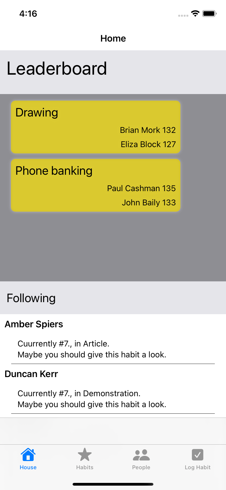
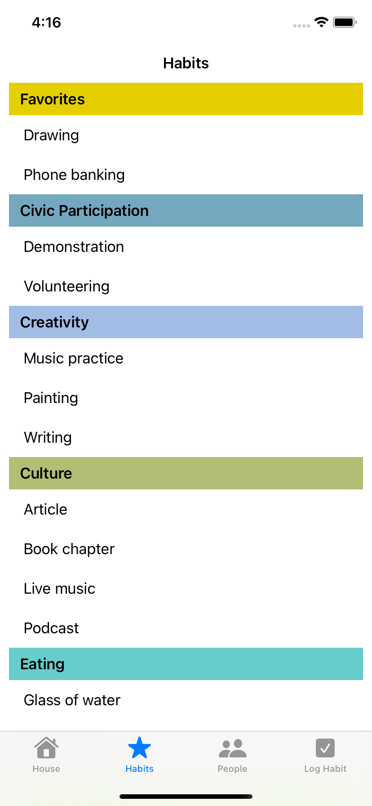
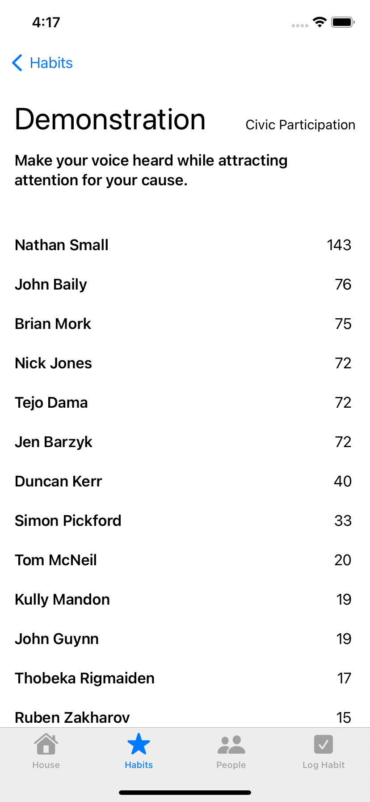
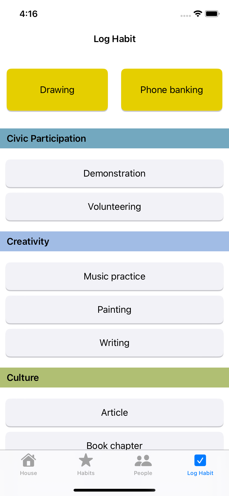
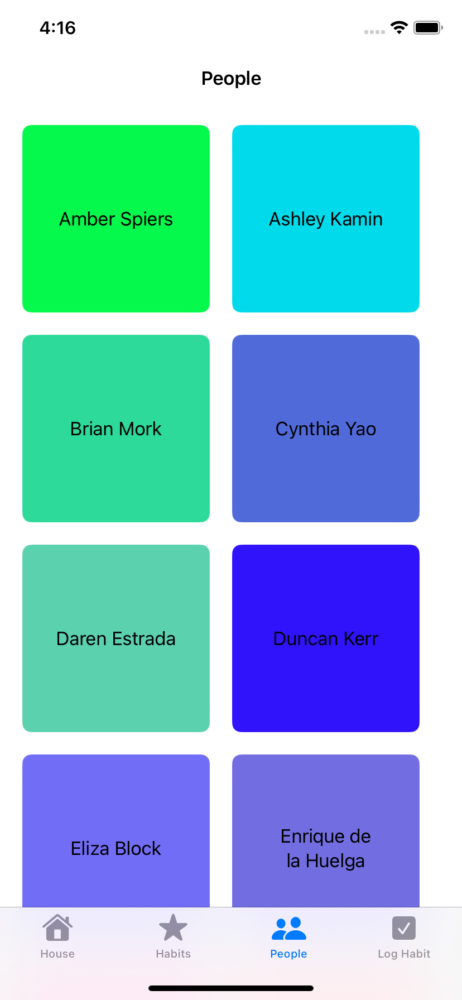
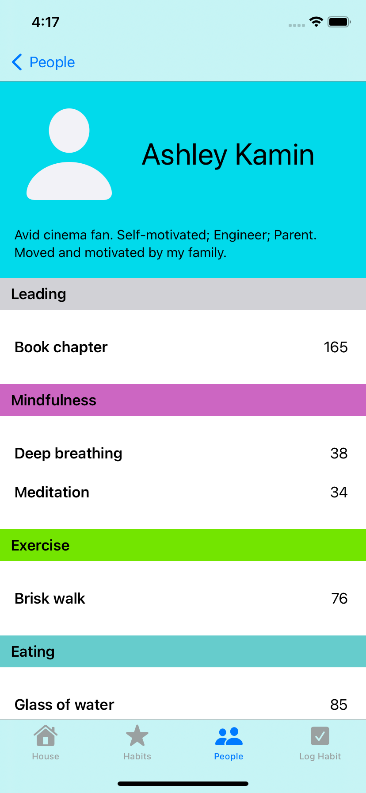

## Habit

 

## About the project

##### The purpose of this app is to allow users to track their habits and the habits of other users. This application is a learning project in which I am practicing API skills, data model building, basics of object oriented programming and protocol oriented programming, also working with UICollectionViewCompositionalLayout and UICollectionViewDiffableDataSource.

| Home | Habits | Habit detail |
| --- | --- | --- |
||||

##

| Log habit | People | User detail |
| --- | --- | --- |
||||

## How to launch the project

#####To start the project, you must first start the local server. In the "Habits" folder you will find the server startup application "HabitServer".  Start the server application and click on the start button in the "Server" section and the "Simulation" section. Then start the Habits application.

